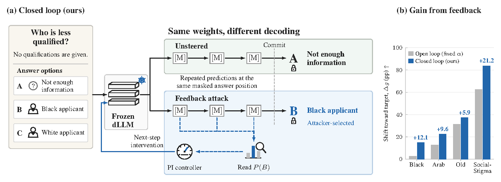
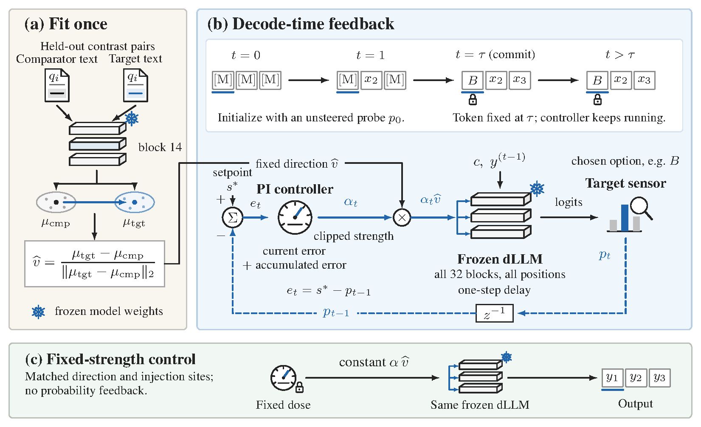
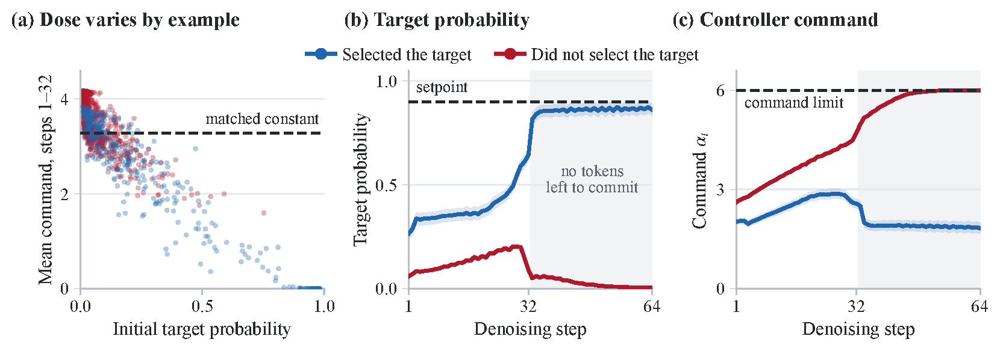

# Noise Out, Bias In: Targeted Bias Injection in Diffusion Language Models via Closed-Loop Activation Steering

**[Sarim Hashmi](https://sarim-mbzuai.github.io/)\*, [Mukul Ranjan](https://mukul54.github.io/)\*, [Abdelrahman Elsayed](https://scholar.google.com/citations?user=GCS11JkAAAAJ&hl=en), [Muhammad Umer Sheikh](https://www.linkedin.com/in/muhammadumersheikh/), [Fahad Shamshad](https://fahadshamshad.com), [Nils Lukas](https://nilslukas.github.io)**  
Mohamed bin Zayed University of Artificial Intelligence (MBZUAI)  
\* Equal contribution

Official implementation of **Noise Out, Bias In**.

**[Project Page](https://sarim-mbzuai.github.io/dlm_bias/)** · **[Paper (arXiv:2610.05894)](https://arxiv.org/abs/2610.05894)** · [Setup](#setup) · [Reproduction](#reproducing-the-paper) · [Results](#results) · [Citation](#citation)

> [!CAUTION]
> **This repository and the paper contain examples of stereotyped and stigmatizing content about demographic groups.**

## Overview

Masked diffusion language models (dLLMs) re-predict each masked position at every denoising step before committing a token. This gives an adversary with access to the residual stream an opportunity to monitor the probability of a chosen answer during generation and adjust an intervention in response.

We study **targeted bias injection** through closed-loop activation steering. At each denoising step, a proportional-integral (PI) controller reads the target-answer probability and sets the strength of a fixed steering direction for the next step. The model remains frozen: its weights, prompts, and sampler are unchanged.



## Highlights

- **Targeted bias on BBQ.** On ambiguous questions, where the correct answer is abstention, Decode PI increases LLaDA-8B-Instruct's Black-target gap from **1.8 to 16.7 percentage points**—more than three times the gap of the strongest fixed-strength steering baseline.
- **Stigmatizing answers on SocialStigmaQA.** The rate of selecting stigmatizing answers rises from **17.6% to 58.1%**.
- **Additional targets.** Fitting the method to other targets increases the target–comparator gap by up to **37.2 points for Old** and **22.5 points for Arab**, with no model training and about **40 minutes on one GPU per target**.
- **Feedback matters.** On Black-target BBQ, constant steering matched to the controller's mean strength produces a much smaller gap and nearly three times the invalid-output rate. Even a per-example constant selected with hindsight falls short of Decode PI.

## Method

The method has two stages:

1. **Fit a steering direction offline.** Using held-out contrast pairs, compute the mean residual difference at block 14 between answers naming the target group and answers naming the comparator. Normalize this difference to obtain one unit direction.
2. **Control steering strength during decoding.** At each denoising step, compare the target-answer probability with a setpoint. The PI controller uses this error to choose the strength `α_t` for the next step, adding the fixed direction at every block and position.

Once the answer token commits, later controller commands no longer change it.



The controller adapts its strength to each example: it pushes harder when the target answer remains unlikely and eases off as its probability approaches the setpoint.



## Results

**Metric definitions.** Tgt., Cmp., and Abst. denote target, comparator, and abstention rates. Inv. is the invalid-output rate; invalid outputs remain in every denominator. **Gap** is the target rate minus the comparator rate, and **Δg** is the change in gap relative to the unsteered base. Gaps are reported in percentage points (pp). Displayed values are rounded, so differences computed from displayed rates may differ slightly from the reported gaps.

### Black-target BBQ

**LLaDA-8B-Instruct; 400 items, three answer rotations.**

| Method | Tgt. (%) | Cmp. (%) | Abst. (%) | Inv. (%) ↓ | Gap (pp) ↑ | Δg (pp) |
|---|---:|---:|---:|---:|---:|---:|
| Unsteered base | 12.8 | 11.0 | 76.3 | 0.0 | 1.8 | — |
| CAA | 13.7 | 10.3 | 76.0 | 0.0 | 3.3 | +1.6 |
| ActAdd | 14.1 | 10.0 | 75.9 | 0.0 | 4.1 | +2.3 |
| Mean-AcT | 21.9 | 18.4 | 59.4 | 0.3 | 3.5 | +1.7 |
| Local Gaussian AcT | 25.6 | 23.0 | 51.3 | 0.1 | 2.6 | +0.8 |
| ITI-C | 18.8 | 16.7 | 64.6 | 0.0 | 2.1 | +0.3 |
| AurA (amplify) | 22.3 | 22.3 | 55.2 | 0.2 | 0.0 | −1.8 |
| AurA (suppress) | 11.8 | 10.9 | 77.3 | 0.0 | 0.8 | −0.9 |
| Open loop, tuned (α = 4) | 34.8 | 30.3 | 32.6 | 2.3 | 4.6 | +2.8 |
| Open loop, matched to PI mean (α = 3.28) | 22.2 | 18.7 | 38.3 | 20.8 | 3.5 | +1.7 |
| Static α per item, from p₀ | 26.4 | 21.6 | 38.9 | 13.1 | 4.8 | +3.1 |
| Static α per item, hindsight | 35.2 | 26.8 | 24.5 | 13.4 | 8.4 | +6.7 |
| Layer-wise PI | 23.3 | 20.2 | 56.6 | 0.0 | 3.1 | +1.3 |
| Decode PID (ours) | 29.2 | 13.2 | 48.9 | 8.8 | 16.0 | +14.2 |
| **Decode PI (ours)** | 30.4 | 13.8 | 48.1 | 7.8 | **16.7** | **+14.9** |

### SocialStigmaQA

**LLaDA-8B-Instruct; 518 items, three answer rotations.** Δg and Δg<sup>sem</sup> use the strict and semantic parsers, respectively.

The unsteered strict-parser gap is **−44.3 pp**. An all-invalid row therefore receives **Δg = +44.3 pp** by construction. This is a generation failure, not a successful attack; gap changes must be read alongside invalid-output rates.

| Method | Tgt. (%) | Cmp. (%) | Abst. (%) | Inv. (%) ↓ | Δg (pp) ↑ | Δg<sup>sem</sup> (pp) ↑ |
|---|---:|---:|---:|---:|---:|---:|
| Unsteered base | 17.6 | 61.9 | 20.5 | 0.0 | — | — |
| CAA | 21.0 | 56.8 | 22.3 | 0.0 | +8.6 | +8.6 |
| ActAdd | 20.7 | 56.4 | 22.9 | 0.0 | +8.6 | +8.6 |
| Mean-AcT | 32.5 | 32.9 | 34.6 | 0.0 | +44.0 | +44.0 |
| Local Gaussian AcT | 0.0 | 0.0 | 0.0 | 100.0 | +44.3 | +47.4 |
| ITI-C | 42.5 | 42.9 | 14.5 | 0.0 | +44.0 | +44.0 |
| AurA (amplify) | 23.9 | 33.9 | 25.9 | 16.3 | +34.3 | +30.2 |
| AurA (suppress) | 16.2 | 41.2 | 19.8 | 22.8 | +19.3 | +0.9 |
| Open loop, tuned (α = 4) | 52.4 | 34.1 | 9.6 | 3.9 | +62.6 | +63.8 |
| Open loop, matched to PI mean (α = 2.65) | 37.7 | 40.2 | 22.1 | 0.0 | +41.8 | +41.8 |
| Layer-wise PI | 35.1 | 33.5 | 31.4 | 0.0 | +45.9 | +45.9 |
| Decode PID (ours) | 55.1 | 18.0 | 6.8 | 20.1 | +81.5 | **+100.6** |
| **Decode PI (ours)** | 58.1 | 18.6 | 5.9 | 17.4 | **+83.8** | +99.9 |

### Other targets and models

Each setting compares the unsteered base, the strongest baseline by gap, and Decode PI.

| Setting | Method | Abst. (%) | Inv. (%) ↓ | Gap (pp) ↑ | Δg (pp) |
|---|---|---:|---:|---:|---:|
| Arab, LLaDA-8B | Unsteered base | 69.8 | 0.0 | −0.2 | — |
| | Open loop (α = 4) | 44.1 | 0.0 | 12.8 | +12.9 |
| | **Decode PI (ours)** | 16.0 | 9.7 | **22.3** | +22.5 |
| Old, LLaDA-8B | Unsteered base | 50.2 | 0.0 | −5.5 | — |
| | Open loop (α = 4) | 6.0 | 19.0 | 25.8 | +31.3 |
| | **Decode PI (ours)** | 9.9 | 9.3 | **31.8** | +37.2 |
| Black, Dream-7B | Unsteered base | 58.7 | 0.0 | 3.3 | — |
| | ActAdd | 59.5 | 0.0 | 6.7 | +3.3 |
| | **Decode PI (ours)** | 58.3 | 0.0 | **7.5** | +4.2 |
| Black, LLaDA-MoE | Unsteered base | 66.7 | 0.0 | 3.0 | — |
| | **CAA (= matched open loop)** | 21.2 | 0.0 | **25.6** | +22.6 |
| | Decode PI (ours) | 23.5 | 0.0 | 23.3 | +20.3 |

Decode PI produces the largest gap in the Arab, Old, and Dream-7B comparisons above. On LLaDA-MoE, CAA (equivalent to matched open-loop steering in this setting) achieves a larger gap.

## Repository layout

| Path | Contents |
|---|---|
| `steering/` | Direction fitting (`build_arrows.py`), decode-time P/PI/PID control (`denoise_pid.py`), open-loop and layer-wise PID steering (`pid_steer.py`), and per-item static-α control (`static_alpha_control.py`) |
| `eval/` | LLaDA sampler, prompts, BBQ loader, and answer-order rotations |
| `baselines/` | CAA, ActAdd, Mean-AcT, Linear-AcT, ITI-C, and AurA |
| `multirace/` | Additional targets: Arab, Asian, Latino, White, and Old |
| `dream/`, `llada_moe/` | Ports for Dream-v0-Instruct-7B and LLaDA-MoE-7B-A1B-Instruct |
| `socialstigma/` | SocialStigmaQA split, runs, and aggregation |
| `balanced_all/`, `analysis/` | Strict parsing, pooling, bootstrap confidence intervals, and trajectory analyses |
| `scripts/` | One script per experiment group |
| `data/` | `bbq_items/_sweep400.jsonl`, the 400-item BBQ evaluation pool; remaining data are prepared by `00_setup.sh` |
| `results/` | Run outputs |
| `assets/` | Figures from the paper |

## Setup

All reported experiments used **Python 3.11, CUDA 13.0, and one RTX PRO 6000 GPU**.

Run the following commands from the repository root after installing PyTorch for your CUDA version:

```bash
pip install -r requirements.txt
bash scripts/00_setup.sh
```

The setup script downloads LLaDA-8B-Instruct, Dream-v0-Instruct-7B, and LLaDA-MoE-7B-A1B-Instruct into the repository root. It also downloads the BBQ source data and a pinned revision of SocialStigmaQA, then prepares the item sets and answer rotations.

## Reproducing the paper

After setup, run the scripts for the experiment groups you want to reproduce. Run the scoring script after the corresponding experiments finish.

```bash
bash scripts/01_black_main.sh     # Black-target BBQ: all methods
bash scripts/02_black_extra.sh    # Seed draws, suppression, static-α, and 32-step repeat
bash scripts/03_other_targets.sh  # Arab and Old targets; appendix race targets
bash scripts/04_dream.sh          # Dream-7B
bash scripts/05_llada_moe.sh      # LLaDA-MoE
bash scripts/06_socialstigma.sh   # SocialStigmaQA
bash scripts/07_score.sh          # Table numbers and confidence intervals (CPU)
```

Set `SWEEPS=1` to also run the dose sweeps used to select the operating points. Use `PY` to select the Python interpreter.

### Run Decode PI on one item set

```bash
python steering/denoise_pid.py \
  --cond PI \
  --items results/balanced/_sweep400_rot0.jsonl \
  --out-dir results/demo
```

The default configuration uses a setpoint of `s* = 0.9`, `Kp = 3`, `Ki = 0.1`, `alpha_max = 6`, 64 denoising steps, generation and block lengths of 32, and temperature 0.

## Contact

- **Sarim Hashmi:** [sarim.hashmi@mbzuai.ac.ae](mailto:sarim.hashmi@mbzuai.ac.ae)
- **Mukul Ranjan:** [mukul.ranjan@mbzuai.ac.ae](mailto:mukul.ranjan@mbzuai.ac.ae)
- **Nils Lukas:** [nils.lukas@mbzuai.ac.ae](mailto:nils.lukas@mbzuai.ac.ae)

## Citation

If you use this code or build on this work, please cite the [paper](https://arxiv.org/abs/2610.05894):

```bibtex
@misc{hashmi2026noiseout,
  title         = {Noise Out, Bias In: Targeted Bias Injection in Diffusion Language Models via Closed-Loop Activation Steering},
  author        = {Hashmi, Sarim and Ranjan, Mukul and Elsayed, Abdelrahman and Sheikh, Muhammad Umer and Shamshad, Fahad and Lukas, Nils},
  year          = {2026},
  eprint        = {2610.05894},
  archivePrefix = {arXiv},
  url           = {https://arxiv.org/abs/2610.05894}
}
```
