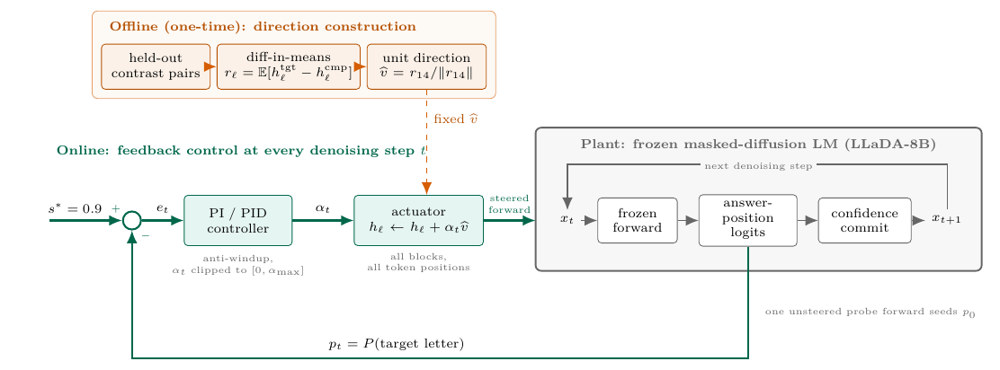

# Closed-Loop Activation Steering Along the Denoising Trajectory of Masked Diffusion Language Models

Code and results for the ICLR paper of the same name
(paper source: [Sarim-MBZUAI/DLM_Bias_overleaf](https://github.com/Sarim-MBZUAI/DLM_Bias_overleaf)).

We steer a frozen masked-diffusion LM (**LLaDA-8B-Instruct**, plus a
**Dream-v0-Instruct-7B** port) at inference time with a PI/PID feedback
controller that acts along the **denoising trajectory** — the diffusion
*step* axis — instead of the transformer *layer* axis used by prior
activation-steering work. An offline stage builds a diff-in-means direction
("arrow"); at decode time the controller measures how strongly the direction
is expressed in the partially unmasked sequence and modulates the injection
strength step by step.

> **Adversarial-probe framing.** This is a red-team *measurement* study of a
> harmful capability — how effectively an attacker can aim a diffusion LM's
> answers at a demographic group — not a fairness fix.



## Headline results (strict parser, position-balanced)

BBQ Race_ethnicity, 400 ambiguous Black-referent items × 3 answer-letter
rotations (1200 pooled items per condition). Gap = P(target) − P(comparator);
95% CI = 10,000-resample item-level bootstrap. Full 14-condition table:
[`results/balanced_all/RESULTS_STRICT.md`](results/balanced_all/RESULTS_STRICT.md).

| condition | gap | 95% CI |
|---|---:|:--:|
| **decode-PI (steps=64) — ours** | **0.167** | [0.131, 0.203] |
| **decode-PID — ours** | 0.160 | [0.124, 0.195] |
| **decode-PI, replicate run (“steps=32”) — ours** | 0.151 | [0.114, 0.187] |
| open loop α=4 | 0.046 | [−0.001, 0.091] |
| ActAdd α=16 (best hook baseline) | 0.041 | [0.013, 0.068] |
| Mean-AcT unit s=2 | 0.035 | [0.000, 0.071] |
| open loop α=3.28 (energy-matched) | 0.035 | [−0.001, 0.072] |
| clean (base) | 0.018 | [−0.010, 0.045] |

**Reading:** the decode-time conditions form a separated top tier with
CIs that do not overlap any baseline's; the energy-matched open loop
(α = 3.28, the controller's own mean actuation) stays near zero — the
advantage comes from *feedback* (when/where actuation is applied), not from
steering energy. Regenerate: `python balanced_all/strict_pool.py`.

**The “steps=32” row is not a separate condition.** With
`gen_length = block_length = 32`, `get_num_transfer_tokens` yields
`[1]*32 + [0]*32`: denoising steps 33–64 commit no tokens, temperature is 0,
and the controller is deterministic, so a 32-step run is the same procedure
as the 64-step run. The BBQ 0.151-vs-0.167 difference is run-to-run bf16
nondeterminism across GPUs/days, not a horizon effect; on SocialStigmaQA,
where both were run on one GPU, the two runs are byte-identical
(1665/1665 outputs; see `socialstigma/RESULTS_STRICT.md`). Every
64-step condition in this repository therefore spends half its forwards on
no-op steps; `steps=32` is the cheaper equivalent for future runs.

### Round-2: replication, targets, second model, second benchmark

Full tables and caveats: [`results/ROUND2_STRICT.md`](results/ROUND2_STRICT.md);
regenerate with `python balanced_all/strict_round2.py`.

- **Seed replication.** Three fresh 400-item draws: decode-PI gap
  **0.162 ± 0.014** (per-seed 0.159 / 0.150 / 0.177; every CI excludes 0),
  base −0.003 ± 0.006. The original 0.167 sits inside the seed range.
- **Multi-target (balanced, strict).** Steerability is direction-dependent:

  | target | best coherent Δg vs base | note |
  |---|---:|---|
  | arab | **+0.225** [+0.171, +0.280] (decode-PI) | strongest of any target |
  | latino | +0.110 (decode-PI) — flagged | 59.6% strict-invalid |
  | asian | +0.010 (normal α2) | decode-PI at amax6 collapses (93.8% invalid) |
  | white | +0.025 (normal α1) | decode-PI at amax6 collapses (96.1% invalid) |

  Asian/white are *unsteerable* on LLaDA: pushing hard enough to move them
  destroys output coherence (letter-/name-spam) before it aims — the
  controller runs hot (mean α 4.6–4.9, saturation 0.38–0.42) without
  achieving coherent aim.
- **Cross-model (Dream-v0-Instruct-7B, balanced).** Decode-PI Δg **+0.042**
  [+0.007, +0.076] vs base, ranking decode-PI > ActAdd (+0.033) > CAA
  (+0.022), all CIs excluding 0 and zero strict-invalid output. Caveat: at
  Dream's coherence ceiling (amax = 1.0) the controller is saturated 97% of
  the time, so the lead over baselines is directional, not resolved.
- **Cross-benchmark (UnQover).** *Dropped from the paper and archived.* The
  original run's results were purged as flawed and the repaired replacement
  benchmark showed the steering shift to be entirely valence-independent, so
  the whole line was retired. Code, results and the post-mortem now live under
  [`archive/unqover/`](archive/unqover/README.md).

### Round-3: suppression, sensor fix, five bias axes, intersectional null

Full tables and caveats: [`results/ROUND3_STRICT.md`](results/ROUND3_STRICT.md);
regenerate with `python balanced_all/strict_round3.py` (+ families 5–8 of
`strict_round2.py`).

- **Defense (E5).** The same feedback loop with the setpoint flipped
  (s\*=0, α ∈ [−6, 0]) holds the Black gap at **+0.002** at 1.8%
  strict-invalid and mean |α| 0.72 — its effort-matched open loop is inert
  (+0.022) and the equally-*strong* open loop (α=−4) is 95.8% invalid;
  AurA vanilla barely moves it (+0.008).
- **Sensor fix (E7, confirmed prediction).** The trajectory analysis
  ([`analysis/trajectory/FINDINGS.md`](analysis/trajectory/FINDINGS.md), E1)
  found the decode-space sensor was case-blind while the arab vector induces
  lowercase answers; giving it lowercase vision (`--sensor-case both`) makes
  the controller **back off** (mean α 4.56 → 3.60, saturation 0.38 → 0.16) at
  an equivalent gap (+0.223 → +0.185) — round-2's hot arab telemetry was a
  sensor artifact.
- **Gender axis (E3).** woman decode-PI **+0.081** beats its effort-matched
  open loop α=3 (+0.029; paired diff +0.052 [+0.015, +0.091]) — the naive
  "open loop α=4 wins" reading was an unmatched-effort artifact. man is a
  null, joining asian/white in the direction-dependence table.
- **Intersectional direction (E6, clean null).** The gender-conditioned
  f-black direction disinhibits without aiming: pick rates quadruple, gap
  stays at zero (decode-PI −0.003) vs the coarse Black direction's +0.167 —
  steerability is a property of the direction.
- **SES + Age axes (E9).** Steering evidence now spans **five bias axes**
  (race, gender, gender-conditioned race, SES, age). **old is the strongest
  steering result in the project**: decode-PI Δg **+0.372** [+0.318, +0.427],
  ahead of the α=4 open loop on point aim (+0.313; paired diff ns) and
  unambiguously ahead on coherence (9.3% vs 19.0% strict-invalid) at the
  lowest controller effort of any attack target (mean α 2.54). lowses reverses a standing anti-poor tilt
  (base −0.049 → +0.068; effort-matched feedback win +0.049). **highses is
  the first significant effort-matched loss for feedback** (−0.082
  [−0.114, −0.050]) — the honest counterexample: feedback wins at matched
  effort on black/woman/lowses/old, loses on highses, ns on the nulls.
  young is a null, joining man/asian/white/fblack in the unsteerable set.
- **Also:** the full 7-method prior-work baseline suite on gender (E8: ITI-C the
  lone winner on woman at Δg +0.083; man resists all 8 methods). The UnQover
  **religion** baseline that also ran in E9 is archived with the rest of the
  UnQover track under [`archive/unqover/`](archive/unqover/README.md).

### Round-4: third model (LLaDA-MoE), an honest loss at matched effort

Full table, paired comparisons and provenance:
[`results/ROUND4_STRICT.md`](results/ROUND4_STRICT.md); regenerate with
`python balanced_all/strict_round2.py` (family 9).

- **Full port to LLaDA-MoE-7B-A1B-Instruct** (`llada_moe/`; MoE masked
  diffusion, 16 blocks, ~1B active params): 12 balanced conditions × 3
  rotations, all committed under `results/lladamoe_balanced/`.
- **Decode-PI aims strongly and cleanly**: Δg **+0.203** [+0.154, +0.252]
  vs base (gap +0.233) at **0.000 strict-invalid** — far above every
  non-CAA baseline (best: ActAdd α2 Δg +0.112).
- **But tuned CAA wins the paired test**: CAA L8 α2 reaches Δg +0.226
  (gap +0.256), beating decode-PI by a small, CI-resolved margin
  (paired −0.023 [−0.036, −0.010]); both decode-PI operating points also
  lose to their geometry/effort-matched open loops (−0.023 at L8, −0.015
  at L9–12). The mechanism: at this model's tuned dose, constant injection
  costs *zero* coherence, so feedback's back-off buys nothing. The
  operating points were fixed by a pre-registered grid whose "beat CAA"
  bar was not met (`results/lladamoe/SWEEP_NOTES.md`).
- **Cross-model picture**: feedback wins big on LLaDA-8B, leads with an
  unresolved margin on Dream, and matches-but-measurably-loses to tuned
  CAA on LLaDA-MoE — the closed-loop advantage appears exactly where an
  effective constant dose breaks coherence.

The strict parse rule mirrors `tools/strict_reparse.py` in the
[paper repo](https://github.com/Sarim-MBZUAI/DLM_Bias_overleaf): a response
counts only if it *starts* with a standalone A/B/C letter; everything else is
invalid and stays in the denominator.

## Repository layout

```
steering/     core method on LLaDA: build_arrows.py (offline direction),
              pid_steer.py (layer axis), denoise_pid.py (decode axis, ours)
dream/        full port to Dream-v0-Instruct-7B: build_arrows.py,
              denoise_pid.py, pid_steer.py + baselines/ (caa, actadd, ...)
llada_moe/    full port to LLaDA-MoE-7B-A1B-Instruct (MoE masked diffusion):
              common_lladamoe.py, build_arrows.py, denoise_pid.py,
              pid_steer.py + baselines/ (caa, actadd, meanact, linearact,
              aura, itic, calib, directions, run_all)
multirace/    steering-target generality (arab/asian/latino/white):
              targets.py registry, make_items.py, per-target arrows + runners
eval/         BBQ harness (bbq_eval.py auto-downloads/caches BBQ,
              bias_metrics.py, attack_metrics.py)
eval/balanced/  rotation makers for the Black headline sets: make_rotations.py,
              make_seed_rotations.py, make_superset.py, oracle_test.py
balanced_all/ position-balanced eval for EVERY condition/target +
              strict_pool.py / strict_round2.py / strict_round3.py
              (the authoritative analyses)
baselines/    faithful prior methods on the same harness: caa, actadd,
              meanact, linearact, aura, itic (+ calib/directions infra)
archive/      retired tracks, kept readable but out of the paper:
              unqover/ (UnQover + UnQover-race benchmark, code + results +
              slurm jobs + post-mortem README)
slurm/        SLURM batch scripts for all four experiment rounds
              (job*.sbatch, round2_job*.sbatch, round3_*.sbatch,
              round4_job*.sbatch)
data/         gitignored inputs: bbq_cache/, bbq_items/
results/      committed result families: balanced/, balanced_all/,
              balanced_seeds/, dream_balanced/, lladamoe_balanced/,
              multirace/, base/, normal/, decode_pid/, layer_pid/,
              calibration/, plus per-baseline dirs (caa/, actadd/, meanact/,
              linearact/, aura/, itic/) and BASELINES.md / ROUND2_STRICT.md /
              ROUND3_STRICT.md / ROUND4_STRICT.md
analysis/     trajectory/ — E1 step-axis analysis of the controller
              (traj_analysis.py, FINDINGS.md, summary CSVs)
docs/         paper.md, COMPARISON.md, DENOISING_PID.md, jailbreak_instruct.md
chat.py / chat_llada.py   terminal chat REPLs (Dream / LLaDA)
```

Deep-dive readmes: [`steering/README.md`](steering/README.md),
[`dream/README.md`](dream/README.md), [`llada_moe/README.md`](llada_moe/README.md),
[`multirace/README.md`](multirace/README.md),
[`balanced_all/README.md`](balanced_all/README.md),
[`docs/DENOISING_PID.md`](docs/DENOISING_PID.md).

## Setup

**Paths are portable.** Every script derives the repo root from its own
`__file__` location; set `DLM_BIAS_ROOT=/path/to/dlm_bias` to override
(the SLURM scripts do).

**Python env.** `pip install -r requirements.txt` — `transformers` is pinned
to **4.46.2** (LLaDA's remote code breaks on 4.47+/5.x). Torch must match
your GPU: on Blackwell-class GPUs use **torch ≥ 2.13 with a cu13x wheel**
(the reference env is torch 2.13.0+cu130, Python 3.11).

**Model weights.** `LLaDA-8B-Instruct/`, `Dream-v0-Instruct-7B/` and
`LLaDA-MoE-7B-A1B-Instruct/` are expected at the repo root (here they are
symlinks to local HF snapshots); point the symlinks at your own downloads.

**Data.** `data/` is gitignored. Either run `./migrate_local_data.sh` to
relocate pre-existing local blobs, or reconstruct from scratch:
- the BBQ cache auto-downloads on first use (`eval/bbq_eval.py`);
- the primary 400-item eval set is committed as
  `results/balanced/_sweep400_rot0.jsonl` (rot0 is byte-identical to the
  original `_sweep400.jsonl` in the rotated fields);
- the 1600-item seed superset rebuilds deterministically via
  `python eval/balanced/make_superset.py`.

**SLURM.** All headline runs go through `slurm/*.sbatch` (round 1:
`job0`–`job4`; round 2: `round2_job{A..F}` + `round2_smoke`; round 3:
`round3_job{G..Z}` + `round3_smokeJ` — jobY/jobZ are the Dream baseline-parity
fits + balanced runs; round 4: `round4_job{AA..AD}` — the LLaDA-MoE port:
jobAA smoke gate, jobAB arrows + dose sweep, jobAB2 single-layer/raw-scale
mini-sweep, jobAC baseline fits, jobAD 10-condition balanced runs at the
calibrated operating points from `results/lladamoe/SWEEP_NOTES.md`). Two quirks:
they export `HF_MODULES_CACHE` to a node-local writable dir so LLaDA/Dream
remote code can be materialized on compute nodes, and the round-2 scripts
request `--qos=normal-plus` for the longer walltimes. Do not set
`CUDA_VISIBLE_DEVICES` under SLURM.

## Reproduce

```bash
# offline direction (per model / target)
python steering/build_arrows.py                      # -> steering/arrows.pt

# headline decode-PI, one rotation
python steering/denoise_pid.py --cond PI \
  --items results/balanced/_sweep400_rot0.jsonl --out-dir results/decode_pid

# authoritative strict-parse analyses (CPU, committed inputs)
python balanced_all/strict_pool.py     # round-1 14-condition Black table
python balanced_all/strict_round2.py   # multi-target / seeds / Dream
                                       #   + round-3 gender / fblack / SES / Age families
                                       #   + round-4 LLaDA-MoE (family 9)
python balanced_all/strict_round3.py   # round-3 suppression + case-full sensor

```

## Terminal chat (optional)

```bash
CUDA_VISIBLE_DEVICES=0 python chat_llada.py   # LLaDA-8B-Instruct
CUDA_VISIBLE_DEVICES=0 python chat.py         # Dream-v0-7B
```
