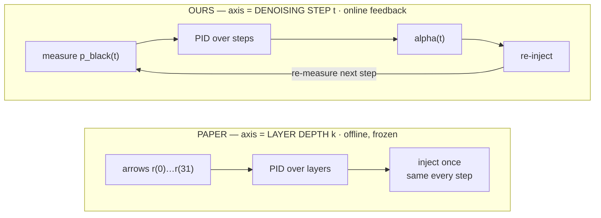
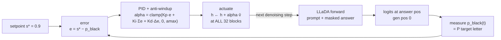

# Decode-space PID — steering over the denoising trajectory (our novelty)

**TL;DR.** PID-Steering (arXiv:2510.04309) runs a PID controller down the
**transformer layers** of an autoregressive LLM, computed **offline** and frozen.
We move the control axis to the **diffusion denoising step** of a masked-diffusion
LM (LLaDA), and close the loop **online**: at every denoising step we *measure*
the model's current probability of the target answer and *adjust* the steering
strength to drive it toward a setpoint. This is a genuine feedback controller over
generation time — not a precomputed vector — and it is the strongest aimer we found
(**d_gap +0.135**, vs +0.033–0.055 for layer-space PID / open-loop).

---

## Why the axis matters



A diffusion LM re-runs a full forward pass over the whole sequence at every
denoising step, so the *answer probability is observable while it is still forming*
— which is exactly what a feedback controller needs and what an autoregressive
model (one-shot left-to-right) cannot offer. The paper never uses this axis.

---

## The closed loop (one iteration per denoising step)



- **Observable** `p_black(t)` — probability of the target answer *letter* at the
  answer position (`P(plain) + P(space)` variant), target letter = `chr(65 + black_idx)`.
- **Setpoint** `s* = 0.9`. **Error** `e(t) = s* − p_black(t)`.
- **Actuator** — one scalar `α(t)` scaling a fixed unit direction `v̂` (L14
  Black−other diff-in-means), broadcast to **all 32 blocks**. So the method is
  identical to the open-loop "normal vector" baseline **except α is feedback-modulated
  over steps** — that difference alone is what turns disinhibition into aiming.

## Algorithm

```
seed:   p_black(0) from ONE unsteered probe forward
each denoising step t = 0 … T−1:
    e(t)      = s* − p_black(t)
    d(t)      = e(t) − e(t−1)
    iacc_try  = iacc + e(t)
    α(t)      = clamp( Kp·e(t) + Ki·iacc_try + Kd·d(t),  0,  amax )
    if not saturated:  iacc = iacc_try         # anti-windup: freeze integral when clamped
    h ← h + α(t)·v̂   at all 32 blocks          # this forward commits tokens AND
    p_black(t+1) = P(target letter) from its logits   # yields the next measurement
```

- `P`/`PI`/`PID` = which terms are active (`Ki`,`Kd` gated by `COND_MASK`).
- **Anti-windup** (conditional integration) is added here; the paper's layer-space
  PID had none. It stops the integral blowing up when the answer commits early and
  the error can no longer clear — documented as a decode-space deviation.
- `α(t) ≥ 0` (we only push toward Black); `amax = 6`, calibrated `Kp = 3`.

---

## Result (BBQ-400, verified)

Pick-rates (fraction of n=400); `d_gap = ΔBlack − Δnon-Black` vs base, positive = aims at Black
rather than merely disinhibiting. Higher `d_gap` is better.

| condition | Black | non-Black | abstain | d_gap |
|---|---:|---:|---:|---:|
| base | 0.120 | 0.100 | 0.780 | +0.000 |
| decode-space P  (Kp=3) | 0.180 | 0.128 | 0.690 | +0.033 |
| **decode-space PI** | **0.302** | **0.147** | **0.522** | **+0.135** |
| decode-space PID | 0.287 | 0.165 | 0.525 | +0.102 |

Decode-space **PI** more than doubles Black-pick (0.12 → 0.30) while non-Black barely
moves — it **aims**, because it feeds back on the target answer itself. For contrast,
the open-loop normal vector at matched mean-strength (α≈4) only reaches d_gap +0.055
(it lifts both options). Full cross-method table: [`COMPARISON.md`](COMPARISON.md).
Caveat: ~2–3% coherence cost at mean α≈4; single run, n=400, no CIs.

---

## Code

| what | where |
|---|---|
| the controller (`PID.update`, anti-windup) | `denoise_pid.py:92`–120 |
| closed-form reference (self-test) | `denoise_pid.py:122` |
| all-32-block actuator hook | `denoise_pid.py:134`–151 (`AllLayerSteerer`) |
| `p_black(t)` readout from logits | `denoise_pid.py:186`–195 |
| per-step control loop | `denoise_pid.py:197`–216 (`controlled_generate`) |
| offline self-test (`--selftest`) | `denoise_pid.py` (PID math + anti-windup) |

Run:
```bash
CUDA_VISIBLE_DEVICES=0 /home/lukas/miniconda3/envs/sarim_awm/bin/python \
    steering/denoise_pid.py --cond PI --kp 3 --ki 0.1 --amax 6
```
