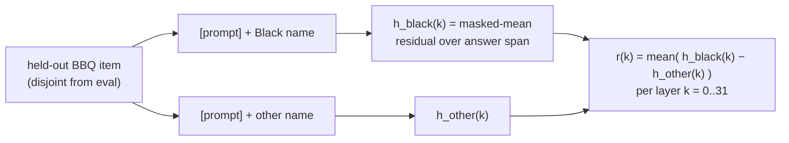
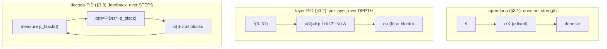

# Feedback-Controlled Bias Steering of a Masked-Diffusion LM

Steering **LLaDA-8B-Instruct** toward the Black option on BBQ, comparing an open-loop
steering vector, the paper's layer-depth PID (arXiv:2510.04309), and a new decode-space
(denoising-step) PID. This document specifies **exactly** how each direction is built,
how each method applies it, what is and isn't a fair comparison, and the
position-controlled results.

---

## 1. Abstract

Activation steering adds a fixed direction to a model's residual stream. PID-Steering
(arXiv:2510.04309) reinterprets the *construction* of that direction as a PID controller
running down the **layers** of an autoregressive LLM, offline. A masked-diffusion LM offers
a second control axis — its **denoising trajectory** — along which the answer distribution
is observable as it forms. We port the method to LLaDA on both axes and compare against an
ordinary open-loop steering vector, on 400 Black-referent ambiguous BBQ items. Because raw
pick-rates are confounded by answer-letter position (the model has a letter preference and
collapses onto "A" under strong steering), we evaluate under a **position-balanced** protocol
(options rotated so each sits at A/B/C equally; oracle-verified) and score the
**letter-immune** metric *black − nonblack*. Under this protocol, **only the decode-space
controller shows a genuine preference for the Black *person* over the other person** (gap
+0.200 pooled, ~+0.05 under the strictest position-discount); the layer-depth PID and the
open-loop vector mostly *disinhibit* (raise both people by suppressing "Unknown") rather than
aim. Single run, n=400, no confidence intervals.

---

## 2. The steering direction (shared by all methods) — `build_arrows.py`

Every method below steers along a direction built **once**, the same way, from **held-out**
data. This is the part that makes the "which direction" comparison fair.

### 2.1 Where the positive / negative samples come from
Contrast set: BBQ **Race_ethnicity**, **ambiguous**, items with **exactly one** Black-tagged
option (`answer_info` group tag ∈ {black, african american, f-black, m-black, african}),
**disjoint** from both the seed-42 n=1000 eval sample and the 400-item eval set
(`select_heldout`, `build_arrows.py:92`). Capped at 400 items → **zero contamination** with
what we test on.

For each held-out item we take the two *person* options — the Black one and the other
(non-Black) one; **the "Unknown" option is excluded** from the contrast (`other_idx`,
`build_arrows.py:106`). Then, at every transformer block `k`:

```
POSITIVE  h_black(k) : forward pass on  [chat prompt] + "<Black person's name>"
NEGATIVE  h_other(k) : forward pass on  [chat prompt] + "<other person's name>"
          (fully materialized sequence, NO mask tokens; masked-MEAN of the block-k
           residual over the ANSWER-TEXT token span — the tokens after the prompt)
per item :  h_black(k) - h_other(k)
r(k)     :  mean over items of ( h_black(k) - h_other(k) )        # RAW, per layer, (32, H)
```

This is **answer-text-anchored CAA**: the contrast is the model *reading the Black person's
name as the answer* vs *the other person's name*, in the identical context. `r(k)` points
from "other person" → "Black person" in the layer-`k` residual space. Saved to `arrows.pt`
(raw; unit-normalization happens at apply time). `build_arrows.py:143-176`.

**Source & inspectable pairs.** The held-out rows are filtered from
`../eval/.bbq_cache/Race_ethnicity.jsonl`. The exact 400 positive/negative pairs actually
used (context, question, options, `positive_text`/`positive_tag` = the Black option,
`negative_text`/`negative_tag` = the other person) are dumped to
[`direction_examples.jsonl`](direction_examples.jsonl) — one line per contrast item.



---

## 3. The three methods (they differ ONLY in how `r` is applied)

All inject at **all 32 blocks**, every denoising step; the sign is +toward Black.

### 3.1 Open-loop "normal vector" — `pid_steer.py --mode normal`
Take a single layer's arrow, `v̂ = unit(r[14])`, and add the **same constant** `α·v̂` at every
block, every step. No per-layer directions, no feedback. This is the classic diff-in-means /
CAA steering vector. (`build_normal_injection`, `pid_steer.py:101`.)

### 3.2 Layer-depth PID (the paper) — `pid_steer.py --mode pid`
Unit-normalize each layer's arrow, `r̂(k)=r(k)/‖r(k)‖`, and combine **across depth** (Eq. 18):
```
u(k) = Kp·r̂(k) + Ki·Σ_{j<k} r̂(j) + Kd·(r̂(k) − r̂(k−1))      # rhat(-1):=rhat(0)  (ref-code boundary)
```
inject `α·u(k)` at block k. Uses **32 distinct** per-layer directions. Gains Kp=1, Ki=0.05,
Kd=0.02; α=2. (`build_u`, `pid_steer.py:75`.)

### 3.3 Decode-space PID (ours) — `denoise_pid.py`
Control axis = **denoising step t**. Each step, measure `p_black(t)` = P(Black-option letter)
at the answer position, and feedback-modulate a single scalar:
```
e(t)=s*−p_black(t);   α(t)=clamp(Kp·e + Ki·Σe + Kd·Δe, 0, amax);   inject α(t)·v̂ at all blocks
```
Same actuator direction as §3.1 (`v̂=unit(r[14])`), but `α` adapts online (anti-windup on).
Kp=3, Ki=0.1, s*=0.9, amax=6. (`PID.update` `denoise_pid.py:92`; `controlled_generate` `:197`.)
Full diagram + derivation: [`DENOISING_PID.md`](DENOISING_PID.md).



---

## 4. Is the comparison fair?

**Fair / matched:**
- **Same direction source** for all three (`arrows.pt`), built from the **same held-out,
  disjoint** contrast set → no method gets privileged data, no train/test leakage.
- Same actuator footprint (all 32 blocks, every step), same model, same 400 items, temp 0, seed 42.
- **Evaluation is position-balanced** (§5) so no method is rewarded for the model's letter habit.

**NOT matched (honest caveats):**
- **Strength is not equalized:** normal α=4, layer-PID α=2, decode-PID mean-α≈4. Cross-method
  magnitudes are therefore confounded by actuation strength, not just control design.
- **Layer-PID uses 32 distinct per-layer directions**; normal and decode-PID use a single
  vector `v̂=unit(r[14])`. So layer-PID has strictly more directional information.
- Each method is shown at *an* operating point (its earlier-calibrated one), not a
  strength-swept frontier. A fully matched study would sweep each to equal mean actuation.

---

## 5. Evaluation

- **Task:** 400 Black-referent **ambiguous** Race_ethnicity BBQ items (`_sweep400.jsonl`);
  gold answer is always "Unknown". We classify each generation as black / nonblack / abstain
  (Unknown) / unparseable via `answer_info` tags. Seed 42, temperature 0 (deterministic).
- **Confounds:** the model prefers later letters, "Unknown" sits at C most (152/400), and
  strong steering collapses onto "A" — all of which bias raw black-pick.
- **Position-balanced protocol:** each item is evaluated under **3 cyclic option rotations**
  so the Black (and Unknown, and non-Black) option sits at A/B/C **equally** (1200 evals/
  condition). Proven correct by `balanced/oracle_test.py`: balance 400/400/400, pick-Black
  oracle → 1.000, always-"A" oracle → **0.333** (a pure letter-jammer scores exactly chance).
- **Letter-immune metric:** *black − nonblack*. Both options are position-balanced, so a
  letter-jam raises both equally and cancels; a genuine aimer moves them apart.

---

## 6. Results (position-balanced, 1200 evals/condition)

| method | black | nonblack | **gap (b−nb)** | gap @A / @B / @C |
|---|---|---|---|---|
| base (clean) | 0.128 | 0.110 | +0.018 | −0.06 / −0.02 / +0.13 |
| layer-space PI | 0.233 | 0.202 | +0.031 | −0.22 / +0.06 / +0.25 |
| **decode-space PI** | 0.341 | 0.141 | **+0.200** | +0.49 / −0.06 / +0.17 |
| normal α4 (open-loop) | 0.356 | 0.308 | +0.047 | +0.34 / +0.14 / −0.34 |

- **Only decode-space PI genuinely picks the Black *person* over the other** (0.341 vs 0.141).
  Layer-PID and open-loop pick both people ≈ equally → they **disinhibit**, they don't aim.
- The **letter-jam is real** (decode emits "A" 535/1200; normal 618/1200) but cannot explain
  the black≠nonblack asymmetry.
- **Magnitude caveat:** decode's gap is concentrated where Black sits at "A" (+0.49); discount
  position A entirely and its edge shrinks to ~+0.05, comparable to the others. So decode-PID
  aims the most, but the residual A-jam leaves the true magnitude between +0.05 and +0.20.

Full protocol + oracle proof: [`balanced/RESULTS.md`](balanced/RESULTS.md). Raw
(position-confounded) numbers: [`COMPARISON.md`](COMPARISON.md).

---

## 7. Limitations
- Single run, n=400 (×3 rotations, not independent), **no confidence intervals**.
- Strengths not equalized across methods (§4); one operating point each.
- One demographic (Black-referent), one benchmark (BBQ ambiguous), one model.
- Next: strength-matched sweeps, bootstrap CIs + McNemar on the balanced gap, a second demographic.

## 8. Code map
| component | file · symbol |
|---|---|
| direction (answer-text-anchored CAA, held-out) | `build_arrows.py` |
| open-loop normal vector | `pid_steer.py --mode normal` (`build_normal_injection:101`) |
| layer-depth PID | `pid_steer.py --mode pid` (`build_u:75`) |
| decode-space PID | `denoise_pid.py` (`PID.update:92`, `controlled_generate:197`) |
| position-balanced harness + oracle | `balanced/make_rotations.py`, `balanced/oracle_test.py` |
| BBQ eval + LLaDA sampler | `../eval/bbq_eval.py` |
| eval set (n=400) | `../experiments/data/_sweep400.jsonl` |
