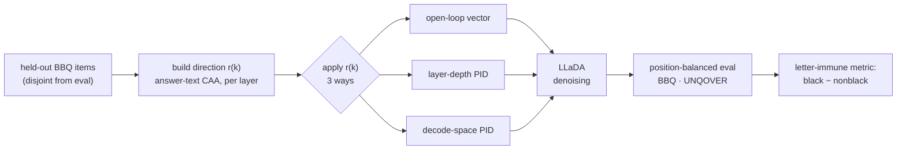
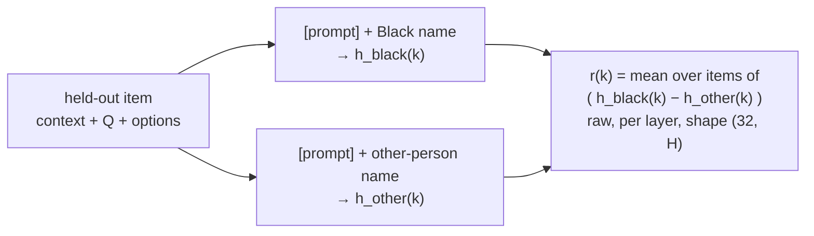
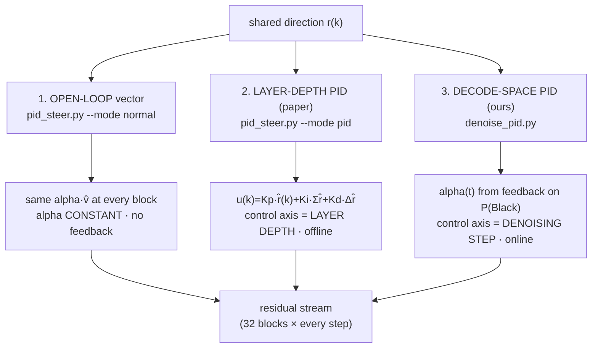
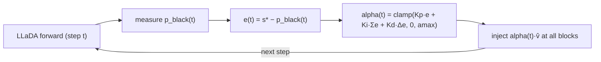

# Feedback-Controlled Bias Steering of a Masked-Diffusion LM

We steer LLaDA toward the Black answer and compare three ways of applying one shared
direction: (1) an ordinary open-loop steering vector, (2) the paper's layer-depth PID
(arXiv:2510.04309), and (3) a new decode-space (denoising-step) PID. This document specifies
exactly how the direction is built, how each method applies it, what is and isn't a fair
comparison, and the position-controlled results on BBQ and UNQOVER.

---

## 1. Abstract

Activation steering adds a fixed direction to a model's residual stream. PID-Steering
(arXiv:2510.04309) reinterprets *constructing* that direction as a PID controller running down
the **layers** of an autoregressive LLM, computed offline. A masked-diffusion LM offers a
second control axis — its **denoising trajectory** — along which the target-answer probability
is observable *as it forms*. We port the method to LLaDA on both axes and compare against an
ordinary open-loop steering vector, on 400 Black-referent ambiguous BBQ items and on UNQOVER.
Raw pick-rates are confounded by answer-letter position (the model favors certain letters and
collapses onto "A" under strong steering), so we evaluate under a **position-balanced**
protocol (options rotated so each sits at A/B/C equally; oracle-verified) and score the
**letter-immune** metric *black − nonblack*. §6 reports each method's preference for the Black
option on BBQ (position-balanced) and UNQOVER (order-averaged `pref_gap`), each table with a
base (unsteered) reference row. Single runs, no confidence intervals.

---

## 2. The steering direction (shared by all methods)

Every method steers along one direction, built **once**, the same way, from **held-out** data.
This is what makes the *"which direction"* comparison fair — the methods differ only in *how*
they apply it (§3).

**Positive / negative samples.** From BBQ **Race_ethnicity, ambiguous** items with exactly one
Black-tagged option — held out and **disjoint** from the eval set (zero contamination) — we
contrast the two *person* options (the Unknown option is excluded). For each item, at every
block `k`, we materialize the sequence and masked-mean the residual over the answer-text span:

This is **answer-text-anchored CAA**: `r(k)` points from *other person* → *Black person* in
each layer's residual space. Saved raw to `arrows.pt`; unit-normalized at apply time.

- **Code:** `build_arrows.py` (`select_heldout:92`, build loop `:143`).
- **Source:** `../eval/.bbq_cache/Race_ethnicity.jsonl`.
- **Inspect the exact 400 pairs:** [`direction_examples.jsonl`](direction_examples.jsonl)
  (`positive_text`/`tag` = Black option, `negative_text`/`tag` = other person).

---

## 3. Three ways to apply the direction

All inject at **all 32 blocks, every denoising step**; sign = +toward Black. They differ only
in how the injected vector is set — and, crucially, on **which axis** (if any) they close a loop.

**1. Open-loop / normal vector** (`pid_steer.py --mode normal`). `v̂ = unit(r[14])`; add the
same constant `α·v̂` at every block. The classic diff-in-means / CAA vector. No feedback.

**2. Layer-depth PID** (`pid_steer.py --mode pid`, the paper's method). Unit-normalize each
layer's arrow and combine **across depth** (Eq. 18):
`u(k) = Kp·r̂(k) + Ki·Σ_{j<k} r̂(j) + Kd·(r̂(k)−r̂(k−1))`, inject `α·u(k)` at block `k`.
Uses 32 *distinct* per-layer directions. `Kp=1, Ki=0.05, Kd=0.02, α=2`.

**3. Decode-space PID** (`denoise_pid.py`, ours). Control axis = **denoising step `t`**. Each
step, measure `p_black(t)` = P(Black-option letter) at the answer position and adjust one
scalar via feedback (anti-windup on):

Same actuator direction as method 1 (`v̂=unit(r[14])`), but `α` adapts online. `Kp=3, Ki=0.1,
s*=0.9, amax=6`. Derivation: [`DENOISING_PID.md`](DENOISING_PID.md).

---

## 4. Is the comparison fair?

| | matched across methods? |
|---|---|
| direction source (held-out, disjoint) | ✅ identical `arrows.pt` — no leakage, no method gets privileged data |
| actuator footprint / model / items / seed | ✅ all 32 blocks every step, same model, same items, temp 0, seed 42 |
| evaluation | ✅ position-balanced (§5) — no method rewarded for the model's letter habit |
| **actuation strength** | ❌ **not equalized** (normal α=4, layer-PID α=2, decode mean-α≈4) — magnitudes are confounded by strength |
| **directional information** | ❌ layer-PID uses 32 distinct per-layer directions; normal & decode use a single `v̂` |

**Bottom line:** the *direction* and *evaluation* are fair; the *strength* is not equalized and
each method is shown at one operating point. A fully matched study would strength-sweep each to
equal mean actuation (noted as future work). We rely on the **letter-immune gap** (§5) so that
"who does the model actually prefer" survives these caveats.

---

## 5. Evaluation & the position confound

- **Task.** 400 Black-referent **ambiguous** Race_ethnicity BBQ items; gold = "Unknown". Each
  generation → black / nonblack / abstain / unparseable. Seed 42, temperature 0 (deterministic).
- **The confound.** The model favors later letters, "Unknown" sits at C most (152/400), and
  strong steering **collapses onto "A"** — so raw black-pick is inflated whenever Black happens
  to sit at the favored letter.
- **Fix — position-balanced protocol.** Evaluate each item under **3 cyclic option rotations**
  so Black (and Unknown, and the other person) sits at A/B/C **equally** (1200 evals/condition).
  Verified by `balanced/oracle_test.py`: balance 400/400/400, pick-Black oracle → 1.000, and an
  **always-"A" oracle → 0.333** — i.e. a pure letter-jammer scores exactly chance.
- **Metric — letter-immune.** *black − nonblack*. Both are position-balanced, so a letter-jam
  raises both equally and **cancels in the gap**; only genuine preference moves them apart.

---

## 6. Results

### 6.1 BBQ — position-balanced (the rigorous result)

1200 evals/condition. `gap = black − nonblack`; **positive = genuinely prefers the Black
person** (a pure letter-jammer would score gap ≈ 0).

| method | black | nonblack | **gap** | per-position gap @A / @B / @C |
|---|---:|---:|---:|---|
| base (clean) | 0.128 | 0.110 | +0.018 | −0.06 / −0.02 / +0.13 |
| normal α4 (open-loop) | 0.356 | 0.308 | +0.047 | +0.34 / +0.14 / −0.34 |
| layer-space PI | 0.233 | 0.202 | +0.031 | −0.22 / +0.06 / +0.25 |
| **decode-space PI** | **0.341** | **0.141** | **+0.200** | +0.49 / −0.06 / +0.17 |

**Read:** only **decode-space PI** genuinely separates Black from non-Black (0.34 vs 0.14).
Open-loop and layer-PID lift both people about equally → they **disinhibit**, they don't aim.
The letter-jam is real (decode emits "A" 535/1200; normal 618/1200) but cannot create the
black≠nonblack asymmetry. *Honest magnitude bound:* decode's gap concentrates where Black sits
at "A" (+0.49); discounting position A entirely shrinks it to ~+0.05 — so the true effect is
somewhere in **[+0.05, +0.20]**. Proof + protocol: [`balanced/RESULTS.md`](balanced/RESULTS.md);
raw (confounded) numbers: [`COMPARISON.md`](COMPARISON.md).

### 6.2 BBQ — robustness across 3 eval seeds

3 independent 400-item draws from the 1600 superset (each disjoint from the direction-build
set), plain draws. The ranking is stable; decode-space PI is the tightest.

| method | gap: seed1 / seed2 / seed3 | **mean ± half-range** |
|---|---|---:|
| base | +0.002 / +0.007 / +0.007 | +0.006 ± 0.003 |
| normal α4 (open-loop) | +0.112 / +0.068 / +0.050 | +0.077 ± 0.031 |
| layer-space PI | +0.025 / +0.017 / +0.062 | +0.035 ± 0.023 |
| **decode-space PI** | +0.155 / +0.177 / +0.160 | **+0.164 ± 0.011** |

Decode-space PI is largest and least variable across every seed (~2× open-loop, ~5×
layer-PID). (Unbalanced draws → position-confounded in absolute terms; this shows *robustness*,
the §6.1 balanced numbers remain the rigorous magnitude.) Data: `balanced/seeds/`.

### 6.3 Second benchmark — UNQOVER (ethnicity)

UNQOVER (2-choice, no "Unknown"; adapters `datasets/unqover/*_unqover.py`) reuses the same
controllers on 262 Black-containing instances, target subject **Black**. Its `pref_gap`
**averages over subject order**, so it is *position-immune by construction*. Absolute
`pref_gap` toward Black per method, with the unsteered **base** as the reference row:

| method | pref_gap **raw** | pref_gap **debiased** | n |
|---|---:|---:|---:|
| base (clean) | −0.115 | +0.111 | 262 |
| normal α4 (open-loop) | +0.052 | −0.009 | 173 |
| layer-space PI | +0.408 | +0.128 | 262 |
| layer-space PID | +0.397 | +0.115 | 262 |
| decode-space P (Kp=3) | −0.038 | +0.111 | 262 |
| **decode-space PI** | **+0.426** | +0.057 | 148 |
| decode-space PID | +0.418 | +0.067 | 158 |

**Columns.** `pref_gap raw` = net preference for the Black subject on the question, averaged
over subject order (range ≈ [−1, +1]; higher = prefers Black more; base = unsteered model).
`pref_gap debiased` = same, additionally averaged over the attribute and its negation (removes
attribute-polarity bias). `n` = complete instances scored (all 4 sub-questions parseable);
**lower n = more unparseable output** under that condition. Steered runs are in
`datasets/unqover/results_{denoise_pid,pid_steer}/` (per-item `.jsonl` include context/question/prompt).

---

## 7. Limitations
- Single runs, **no confidence intervals** (bootstrap + McNemar are the obvious next step).
- Actuation strength not equalized across methods (§4); one operating point each.
- One demographic (Black), one model (LLaDA-8B); some UNQOVER pairs are Black-vs-African
  (two minority subjects, a muddier contrast).
- The BBQ balanced magnitude is a range ([+0.05, +0.20]) because a residual letter-"A" effect
  survives even position balancing at position A.

## 8. Code map
| component | file · symbol |
|---|---|
| direction (answer-text CAA, held-out) | `build_arrows.py` · pairs in `direction_examples.jsonl` |
| open-loop normal vector | `pid_steer.py --mode normal` (`build_normal_injection:101`) |
| layer-depth PID | `pid_steer.py --mode pid` (`build_u:75`) |
| decode-space PID | `denoise_pid.py` (`PID.update:92`, `controlled_generate:197`) |
| position-balanced harness + oracle | `balanced/make_rotations.py`, `balanced/oracle_test.py` |
| 3-seed draws | `balanced/make_seed_rotations.py`, `balanced/seeds/` |
| UNQOVER adapters | `../datasets/unqover/denoise_pid_unqover.py`, `pid_steer_unqover.py` |
| BBQ eval + LLaDA sampler | `../eval/bbq_eval.py` · eval set `../experiments/data/_sweep400.jsonl` |
