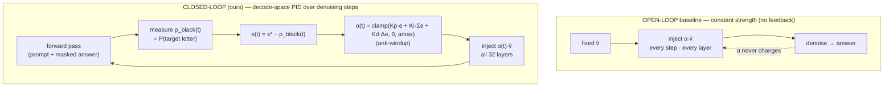

# Paper layout — Feedback-Controlled Bias Steering of a Diffusion Language Model

Working title: **"Steering by Feedback: PID Control over the Denoising Trajectory of a
Masked-Diffusion LM."**

---

## Abstract

Activation steering injects a fixed direction into a model's residual stream to bias its
behavior. Recent work (PID-Steering, arXiv:2510.04309) reinterprets the *construction* of
that direction as a PID controller running **down the layers** of an autoregressive LLM,
computed offline. We ask whether a masked-diffusion LM offers a stronger control axis: its
**iterative denoising trajectory**, along which the answer distribution is observable while
it is still forming. We port PID-Steering to **LLaDA-8B-Instruct** on two axes — the paper's
layer-depth axis and a new **denoising-step** axis — and compare both against an ordinary
(open-loop) steering vector, on the task of biasing the model toward the Black option in
400 Black-referent ambiguous BBQ items. We find that **open-loop steering disinhibits**
(it raises *both* answer options and mostly suppresses abstention), whereas a **closed-loop
controller on the denoising axis aims**: by feeding back on the target-answer probability at
each denoising step and modulating the steering strength, it more than doubles the Black-pick
rate (0.12 → 0.30) while barely moving the competing option — a directional gap of **+0.135**,
versus +0.055 for the matched open-loop vector and +0.033–0.040 for the paper's layer-depth
PID. The integral term drives the gain on both axes; the derivative term does not help. The
effect carries a small (~2–3%) coherence cost. Results are single-run at n=400 without
confidence intervals; the ordering is consistent but not significance-tested.

---

## Section outline

1. **Introduction** — steering as control; open-loop steering disinhibits rather than aims; a
   diffusion LM exposes a *temporal* control axis absent in AR models; contributions.
2. **Background** — activation steering / diff-in-means; PID-Steering over layers (arXiv:2510.04309);
   masked-diffusion generation in LLaDA (block sampling, per-step full forward pass).
3. **Methodology** *(fully specified below)* — direction construction; open-loop baselines;
   closed-loop layer-space PID; closed-loop **decode-space** PID; the actuator; the metric.
4. **Experiments** — BBQ-400 Black-referent ambiguous; open-loop vs closed-loop; ablations
   (P/PI/PID; layer vs decode axis; α / Kp calibration).
5. **Results** *(table below)* — decode-space PI is the strongest aimer; open-loop disinhibits.
6. **Discussion** — why feedback aims (target-aware, backs off on success) vs open-loop pushes blindly.
7. **Limitations** — n=400 single run, no CIs; coherence cost at high strength; one demographic axis.
8. **Ethics** — this is red-team bias *injection* to study a mechanism, on a frozen model.

---

## 3. Methodology

### 3.1 Setup
- **Model:** LLaDA-8B-Instruct (frozen), 32 transformer blocks, H=4096, masked-diffusion
  block sampling (gen 32 / steps 64 / block 32, temperature 0).
- **Seed / determinism:** **seed 42** for BBQ sampling and the held-out / eval split
  (`_sweep400.jsonl`, disjoint from the seed-42 n=1000 sample). Generation is deterministic
  (temperature-0 greedy), so there is no separate sampling seed — runs are exactly reproducible.
- **Task / metric:** 400 Black-referent **ambiguous** BBQ items. We report pick rates
  (Black / non-Black / abstain / unparseable) and the **directional gap**
  `d_gap = (ΔBlack − Δnon-Black)` vs the clean model — **positive = aims at Black**, as
  opposed to merely suppressing the "Unknown" abstention.
- **Direction:** per-layer diff-in-means `r(k) = mean(h_Black) − mean(h_other)` built from
  held-out BBQ items **disjoint** from the 400 (verified). `v̂ = unit(r(14))` is the single
  direction used by the open-loop and decode-space methods.

### 3.2 Open-loop vs closed-loop — the core comparison

All methods add a steering signal along the same direction(s) at all 32 blocks, every
denoising step. They differ **only in how the strength is chosen**:

- **Open-loop** pushes with the same force regardless of the model's current answer, so it
  lifts *both* options once abstention breaks → **disinhibition**, not aiming.
- **Closed-loop (decode-space)** measures the target-answer probability `p_black(t)` at each
  denoising step and adjusts `α(t)` to drive it toward a setpoint `s*`, easing off once the
  target is reached → **target-aware aiming**.

### 3.3 The three controllers

| method | control axis | strength rule | code |
|---|---|---|---|
| **normal vector** (open-loop) | — | `α` constant | `pid_steer.py --mode normal` |
| **layer-space PID** (paper) | transformer depth `k` | `u(k)=Kp·r̂(k)+Ki·Σ_{j<k}r̂(j)+Kd·(r̂(k)−r̂(k−1))`, injected once | `pid_steer.py --mode pid` |
| **decode-space PID** (ours) | denoising step `t` | `α(t)=clamp(Kp·e(t)+Ki·Σe+Kd·Δe, 0, amax)`, `e(t)=s*−p_black(t)`, online | `denoise_pid.py` |

`P/PI/PID` select active terms. Decode-space adds standard **anti-windup** (conditional
integration); the paper's layer-space PID has none. Calibrated: layer-space `Kp=1, Ki=.05,
Kd=.02, α=2`; decode-space `Kp=3, Ki=.1, s*=0.9, amax=6`.

### 3.4 Code paths

| component | file · symbol |
|---|---|
| build per-layer arrows (held-out, disjoint) | `pid_steering/build_arrows.py` |
| open-loop normal vector + layer-space PID | `pid_steering/pid_steer.py` (`--mode normal` / `--mode pid`) |
| **decode-space PID** — controller | `pid_steering/denoise_pid.py:92` (`PID.update`, anti-windup) |
| decode-space — all-layer actuator | `pid_steering/denoise_pid.py:134` (`AllLayerSteerer`) |
| decode-space — `p_black(t)` readout | `pid_steering/denoise_pid.py:186` (`p_black_from_logits`) |
| decode-space — per-step control loop | `pid_steering/denoise_pid.py:197` (`controlled_generate`) |
| BBQ eval harness + LLaDA sampler | `eval/bbq_eval.py` (`build_prompt`, `generate`, `parse_letter`) |
| eval set (n=400) | `experiments/data/_sweep400.jsonl` |
| diagram + deep writeup of the novelty | [`DENOISING_PID.md`](DENOISING_PID.md) |
| full results table + per-item JSONs | [`COMPARISON.md`](COMPARISON.md) · `results/` · `results_denoise/` |

---

## 5. Results (BBQ-400)

| method | control axis | Black | non-Black | abstain | unparse | **d_gap** |
|---|---|---|---|---|---|---|
| base (clean) | — | 0.120 | 0.100 | 0.780 | 0.000 | +0.000 |
| normal vector, α=2 | open-loop | 0.177 | 0.138 | 0.685 | 0.000 | +0.020 |
| normal vector, α=4 | open-loop | 0.370 | 0.295 | 0.328 | 0.007 | +0.055 |
| layer-space PI | layer depth | 0.242 | 0.182 | 0.575 | 0.000 | +0.040 |
| layer-space PID | layer depth | 0.240 | 0.188 | 0.573 | 0.000 | +0.033 |
| **decode-space PI** | **denoising step** | **0.302** | 0.147 | 0.522 | 0.028 | **+0.135** |
| decode-space PID | denoising step | 0.287 | 0.165 | 0.525 | 0.022 | +0.102 |

**Takeaway.** Closed-loop feedback on the denoising axis is the only method that *aims*
rather than disinhibits; the integral term is what buys the gain; the derivative term does
not. Full table and per-item records: [`COMPARISON.md`](COMPARISON.md).

---

## 6. Limitations
- Single run, **n=400, no confidence intervals** — ordering consistent, not significance-tested.
- Decode-space PI/PID carry a ~2–3% coherence cost at mean α≈4.
- One demographic axis (Black-referent), one benchmark (BBQ), one model (LLaDA-8B-Instruct).
- Next: bootstrap CIs + McNemar (decode-PI vs base); second demographic; UNQOVER as a second benchmark.
